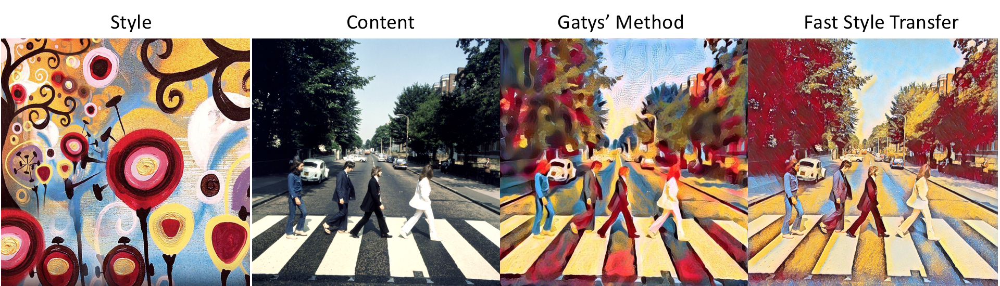

# Neural-Style-Transfer

ECE 285 Machine Learning for Image Processing Project

Team: Overfitting


**Description**
-----------------
<pre>
This is the repository for Neural Style Transfer created by the awesome team Overfitting!
You can use the code in this repository to generate a stylized image by your preference.
Got a webcam? Yep, with your webcam, you can also do real-time stylization!
</pre>
**Requirements**
------------

* **Packages needed to be installed**:
<pre>
Note: Assume Anaconda installed using MacOS
    * numpy               
    * matplotlib             $ pip install matplotlib
    * cv2                    $ conda install -c conda-forge opencv
    * pyTorch                $ conda install pytorch torchvision -c pytorch
    * PIL                    $ pip install PIL 
    * argparse               $ pip install argparse
</pre> 

**Code organization**
-----------------

```
-- slow-style-transfer (Gatys' Method)
    -- scr
       -- slowStyleTransfer.py
-- fast-style-transfer (Johnson's Method)
    -- scr
       -- fastStyleTransfer.py        (Select between fast-style-transfer and live-style-transfer)
       -- imageTransformNet.py        (The Image TransformNet used in the feedforward pass of fastStyleTransfer.py)
       -- vgg16.py                    (The vgg16 model used in fastStyleTransfer.py)
       -- vgg19.py                    (The vgg19 model used in fastStyleTransfer.py)
    -- models                         (The trained models for different style image)
-- dataset
    -- 101_ObjectCategories           (The complete Caltech 101 dataset for training in fast-style-transfer)
-- imgs                     
    -- content-image                  (The content images need to be stylized)
    -- style-image                    (The style images for stylization)
    -- result-image                   (The final stylized images by using the content and style images)
-- live-style-transfer-demo.mp4       (The video to demonstrate the functionality of our live style transfer model)
-- style_transfer.ipynb               (The jupyter notebook which allow the user to select between slow, fast and live style transfer)
```
<pre>
Note: For demonstration, run the style_transfer.ipynb for slow, fast and live style transfer. You can also train you own style model in this notebook, but training might take up to 45 mins.
</pre>


